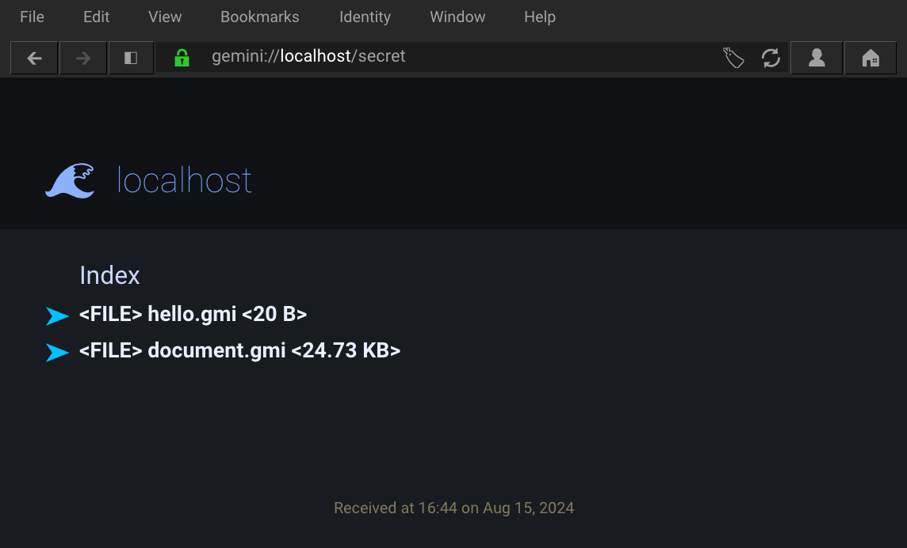

# gem

> gemini server with TLS and script for generating working TLS certs

Supports 
- mime types
- directory listing
- chunked file transfer
- passes most gemini-diagnostics tests
- user-defined charset/lang meta attributes



### build
To build you may need to install `libssl-dev`

```sh
$ sudo apt install libssl-dev
$ make ssl
$ make
$ sudo setcap cap_sys_chroot+ep gem
```
Last step is required for `chroot(2)` (or you can run as root/sudo)

### Program options
```
-h [HOSTNAME]   ex: -h "example.com"   (localhost default)
-p [PORT]       ex: -p 1965            (default)
-d [DOC ROOT]   ex: -d "/var/gemini"
-i [INDEX FILE] ex: -i "index.gmi"     (default)
-e  enumerate directories without an index file
-a  permit requests with a different hostname
```

Run with `./gem -d capsule -ae`

#### SSL cert
To use your own domain name you have to replace `/CN=localhost` in the `ssl` make target to your domain: eg `example.com` => `/CN=example.com`.

Then you must also specify the domain as the hostname when running the program:
```sh
./gem -h "example.com" -d capsule -ae
```

The `-a` flag can be useful for accessing the server over IP (perhaps over LAN) without a DNS name. The `-d` flag must always be specified.

#### meta header lang/charset attribute
To include these attributes in the meta header just create a `.lang` file with the language code, example; `en-GB`. Same with charset: `.charset` -- example: `utf-8`. Also make sure it is enabled (`1`) in `config.h`.

These 'rules' apply for all the files in that directory.

```
capsule/
├── .charset      <--- "utf-8"
├── dog.png
├── index.gmi
├── .lang         <--- "en-GB"
└── misc
    ├── 🦊🐦🦉🐞🦓
    │   ├── 🦩.gmi
    │   ├── 🐅.gmi
    │   ├── 🐧.gmi
    │   ├── 🐬.gmi
    │   └── 🐺.gmi
    ├── jp
    │   ├── .charset      <--- "Shift_JIS"
    │   ├── .lang         <--- "ja"
    │   └── samurai_text_shift_jis.txt
    └── міжнародний
        ├── Sultan'ın garaj uzmanı
        ├── документ на русском языке.txt
        ├── คำสารภาพ
        └── 中国
```

#### Raspberry Pi
Makefile now conditionally includes flags that don't seem to work on the Pi. Below is an example to easily get started.
```sh
$ sudo apt update && sudo apt install -y libssl-dev
$ make ssl
$ make
$ sudo setcap cap_sys_chroot+ep gem
$ ./gem -d capsule -ae
```

## Misc

Great development tool:
```
https://github.com/michael-lazar/gemini-diagnostics
```

Test gemini client:
```sh
echo "gemini://localhost" | openssl s_client -quiet -crlf -connect localhost:1965
```