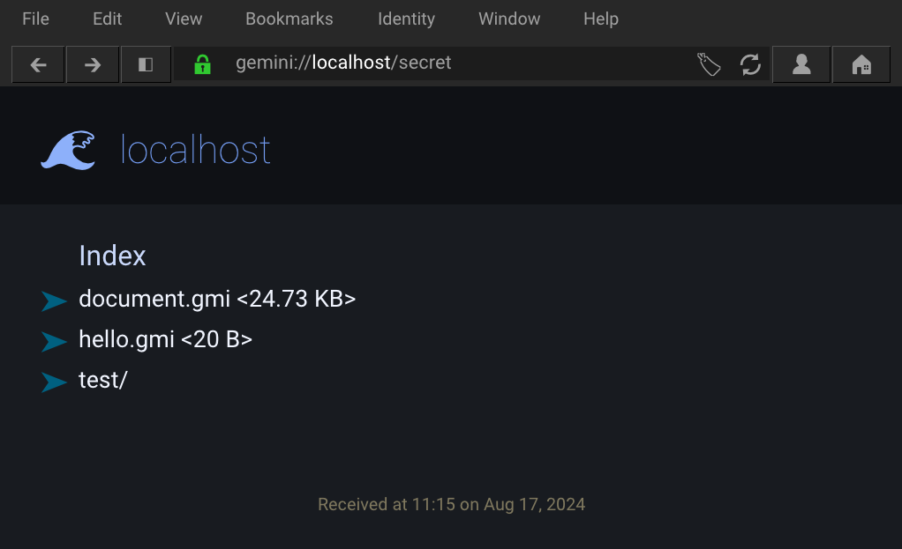

# gem

Running on `gemini://gemmy.dev/`

> gemini server with TLS and script for generating working TLS certs

Supports 
- mime types
- directory listing
- chunked file transfer
- passes most gemini-diagnostics tests
- user-defined charset/lang meta attributes



### build
To build you may need to install `libssl-dev`

```sh
$ sudo apt install libssl-dev
$ make ssl
$ make
$ sudo setcap cap_sys_chroot+ep gem
```
Last step is required for `chroot` (or you can run as root/sudo)

### Program options
```
-c [pub cert path]   ex: -c "gem.crt"     (tls/server.crt default)
-k [priv key path]   ex: -k "gem.key"     (tls/server.key default)
-h [HOSTNAME]        ex: -h "example.com" (localhost default)
-p [PORT]            ex: -p 1965          (default)
-d [DOC ROOT]        ex: -d "/var/gemini"
-i [INDEX FILE]      ex: -i "index.gmi"   (default)
-e  enumerate directories without an index file
-a  permit requests with a different hostname
-v  print request information
```

Run with `./gem -d capsule -aev`

### Run gem somewhere other than the git project
The options `-c` for the certificate file (pub key) and `-k` for the private key can be used for this purpose.
```sh
# example setup
$ ./gem -aev -d ~/gemini/capsule -c server.crt -k secret.key
```

#### SSL cert
To use your own domain name you have to replace `/CN=localhost` in the `ssl` make target to your domain: eg `example.com` => `/CN=example.com`.

Then you must also specify the domain as the hostname when running the program:
```sh
./gem -h "example.com" -d capsule -aev
```

The `-a` flag can be useful for accessing the server over IP (perhaps over LAN) without a DNS name.

The `-d` flag must always be specified.

### meta header lang/charset attribute
These are optional, special attributes in the gemini header that define the charset and language used on the page. 

#### language
To define the language for all the text files in a directory, simply create a `.lang` file with an [ISO 639 2-letter-code](https://en.wikipedia.org/wiki/List_of_ISO_639_language_codes#Table) optionally followed by by an [ISO 3166-1 country code](https://en.wikipedia.org/wiki/List_of_ISO_3166_country_codes#Current_ISO_3166_country_codes).

Examples:
```
en-GB
en-US
ru
es-MX
sv-FI
ja
```
#### charset
Character encoding. `utf-8` should be enough but some text may require any of the following to render properly:
```
ISO-8859-1
Windows-1251
Windows-1252
GB2312
Shift_JIS
```

These 'rules' apply for all the files in that directory. Also make sure it is enabled (`1`) in `config.h`.

```
capsule/
├── .charset      <--- "utf-8"
├── dog.png
├── index.gmi
├── .lang         <--- "en-GB"
└── misc
    ├── 🦊🐦🦉🐞🦓
    │   ├── 🦩.gmi
    │   ├── 🐅.gmi
    │   ├── 🐧.gmi
    │   ├── 🐬.gmi
    │   └── 🐺.gmi
    ├── jp
    │   ├── .charset      <--- "Shift_JIS"
    │   ├── .lang         <--- "ja"
    │   └── samurai_text_shift_jis.txt
    └── міжнародний
        ├── Sultan'ın garaj uzmanı
        ├── документ на русском языке.txt
        ├── คำสารภาพ
        └── 中国
```

## Misc

Great development tool:
```
https://github.com/michael-lazar/gemini-diagnostics
```

Test gemini client:
```sh
echo "gemini://localhost" | openssl s_client -quiet -crlf -connect localhost:1965
```

This project is licensed under the terms of the GNU General Public License v2.0.